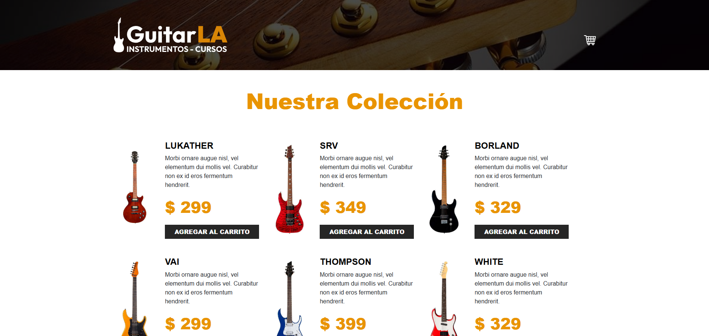

# 🎸 GuitarLA

Este proyecto simula una tienda de guitarras donde los usuarios pueden:

- Explorar una colección de guitarras.
- Agregar productos al carrito.
- Aumentar o disminuir la cantidad de cada artículo.
- Ver el total actualizado automáticamente según los cambios en el carrito.

Todo esto con una interfaz clara, moderna y responsiva gracias a Tailwind CSS.

## 🛠️ Tecnologías utilizadas

- React
- TypeScript (tipado estricto)
- Tailwind CSS
- useReducer (manejo del estado del carrito)
- useMemo (optimización del cálculo de totales)

## 📸 Vista previa

## 🔗 Live Demo

[https://guitarla-reducer05.netlify.app/](https://guitarla-reducer05.netlify.app/)

# 🎸 GuitarLA

This project simulates a guitar store where users can:

- Browse a guitar collection.
- Add products to the cart.
- Increase or decrease the quantity of each item.
- View the updated total price automatically as changes are made.

All built with a clean, modern, and responsive interface powered by Tailwind CSS.

## 🛠️ Technologies Used

- React
- TypeScript (strict typing)
- Tailwind CSS
- useReducer (for cart state management)
- useMemo (for performance optimization)

## 📸 Preview

## 🔗 Live Demo

[https://guitarla-reducer05.netlify.app/](https://guitarla-reducer05.netlify.app/)

